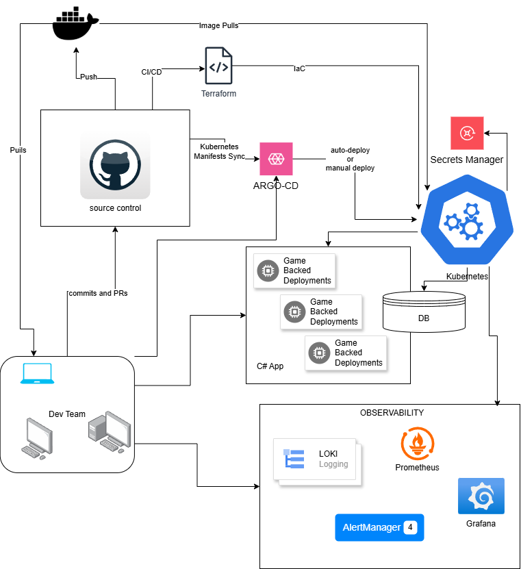

# Sample Web Api backend for the Game
This is a sample Web Api backend for the Game Web App. It is written in C# using the .NET Core framework.

### App live at:
------------------
- ArgoCD:     http://34.59.100.243 
- GameApi:    http://34.59.156.205:8080/players
- Grafana:    http://34.121.51.254
- Prometheus: http://34.27.231.140:9090
-------------------

### Proposed Architecture
<Details>
<summary> click to expand </summary>



</Details>

## Local Dev

- Make sure you have .Net SDK and CLI installed.
```
wget https://dot.net/v1/dotnet-install.sh -O dotnet-install.sh
chmod +x ./dotnet-install.sh
./dotnet-install.sh --version latest
## Make sure to have the path sorted out
```

- Instantiate the project
```
dotnet new webapi -n GameBackend
```

### Observability Addon
We want to add the ability to monitor our app, early on in our development cycle.

```
dotnet add package prometheus-net.AspNetCore

```
### Logging
```
dotnet add package Serilog.AspNetCore
dotnet add package Serilog.Sinks.Console
dotnet add package Serilog.Sinks.File
dotnet add package Serilog.Sinks.Elasticsearch

```


- Create a container and run it locally
> I'm choosing to use podman instead of docker because 
    - out of box, it provides better security features
    - allows me to run as non-root user, making it better for security best practices
    - offers better integration with kubernetes
    - lighter than docker (which is nice because I'm running this on a SteamDeck)
    - adheres to OCI standards

### Build
```
podman build -t game-backend .

```

### Run
```
podman run -p 8080:8080 game-backend
info: Microsoft.Hosting.Lifetime[14]
      Now listening on: http://[::]:8080
info: Microsoft.Hosting.Lifetime[0]
      Application started. Press Ctrl+C to shut down.
info: Microsoft.Hosting.Lifetime[0]
      Hosting environment: Production
info: Microsoft.Hosting.Lifetime[0]
      Content root path: /app
```

### Tag and Push
```
podman tag game-backend shreyasgune/dotnet-web-api:0.1

podman push shreyasgune/dotnet-web-api:0.1 
Getting image source signatures
Copying blob 84c9c5ff8f7f done  
Copying blob cab7a4d937d9 done  
Copying blob dbeea92a9458 done  
Copying blob 54538f06ae8f done  
Copying blob e6e3e0e27a6c done  
Copying blob 7914c8f600f5 done  
Copying blob cc2fa59615b4 done  
Copying config 0466182711 done  
Writing manifest to image destination
Storing signatures

```

Image can be found at: https://hub.docker.com/repository/docker/shreyasgune/dotnet-web-api/tags
Image pull: `docker pull shreyasgune/dotnet-web-api:0.1` or `podman pull shreyasgune/dotnet-web-api:0.1`
> Note: For production, this will be secured with a private registry, behind firewalls and with proper access control measures.

### Testing
```
Create Players
curl -X POST "http://localhost:8080/players" -H "Content-Type: application/json" -d '{"id":1, "name":"Alice", "score":0}'
curl -X POST "http://localhost:8080/players" -H "Content-Type: application/json" -d '{"id":17, "name":"Shreyas", "score":666}'

curl -X POST "http://34.59.156.205:8080/players" -H "Content-Type: application/json" -d '{"id":1, "name":"Markus Toivonen", "score":0}'
curl -X POST "http://34.59.156.205:8080/players" -H "Content-Type: application/json" -d '{"id":17, "name":"Shreyas", "score":666}'


GET all players (do it multiple times, to see the counter increment)
curl -X GET "http://localhost:8080/players"
[{"id":1,"name":"Alice","score":0},{"id":17,"name":"Shreyas","score":666}]

GET a specific player via ID
curl -X GET "http://localhost:8080/players/17"
{"id":17,"name":"Shreyas","score":666}%

GET player_requests_total counter via metrics endpoint
curl -s -X GET "http://localhost:8080/metrics" | grep player_requests_total
# HELP player_requests_total Total number of requests to the players endpoint
# TYPE player_requests_total counter
player_requests_total 3

```

### Metrics Endpoint Sample
<details>
<summary> sample output from /metrics </summary>

```
# HELP player_requests_total Total number of requests to the players endpoint
# TYPE player_requests_total counter
player_requests_total 3
# HELP http_request_duration_seconds The duration of HTTP requests processed by an ASP.NET Core application.
# TYPE http_request_duration_seconds histogram
http_request_duration_seconds_sum{code="201",method="POST",controller="",action="",endpoint="/players"} 0.0121344
http_request_duration_seconds_count{code="201",method="POST",controller="",action="",endpoint="/players"} 2
http_request_duration_seconds_bucket{code="201",method="POST",controller="",action="",endpoint="/players",le="0.001"} 1
http_request_duration_seconds_bucket{code="201",method="POST",controller="",action="",endpoint="/players",le="0.002"} 1
http_request_duration_seconds_bucket{code="201",method="POST",controller="",action="",endpoint="/players",le="0.004"} 1
http_request_duration_seconds_bucket{code="201",method="POST",controller="",action="",endpoint="/players",le="0.008"} 1
http_request_duration_seconds_bucket{code="201",method="POST",controller="",action="",endpoint="/players",le="0.016"} 2
http_request_duration_seconds_bucket{code="201",method="POST",controller="",action="",endpoint="/players",le="0.032"} 2
http_request_duration_seconds_bucket{code="201",method="POST",controller="",action="",endpoint="/players",le="0.064"} 2
http_request_duration_seconds_bucket{code="201",method="POST",controller="",action="",endpoint="/players",le="0.128"} 2
http_request_duration_seconds_bucket{code="201",method="POST",controller="",action="",endpoint="/players",le="0.256"} 2
http_request_duration_seconds_bucket{code="201",method="POST",controller="",action="",endpoint="/players",le="0.512"} 2
http_request_duration_seconds_bucket{code="201",method="POST",controller="",action="",endpoint="/players",le="1.024"} 2
http_request_duration_seconds_bucket{code="201",method="POST",controller="",action="",endpoint="/players",le="2.048"} 2
http_request_duration_seconds_bucket{code="201",method="POST",controller="",action="",endpoint="/players",le="4.096"} 2
http_request_duration_seconds_bucket{code="201",method="POST",controller="",action="",endpoint="/players",le="8.192"} 2
http_request_duration_seconds_bucket{code="201",method="POST",controller="",action="",endpoint="/players",le="16.384"} 2
http_request_duration_seconds_bucket{code="201",method="POST",controller="",action="",endpoint="/players",le="32.768"} 2
http_request_duration_seconds_bucket{code="201",method="POST",controller="",action="",endpoint="/players",le="+Inf"} 2
http_request_duration_seconds_sum{code="200",method="GET",controller="",action="",endpoint="/players"} 0.005078
http_request_duration_seconds_count{code="200",method="GET",controller="",action="",endpoint="/players"} 3
http_request_duration_seconds_bucket{code="200",method="GET",controller="",action="",endpoint="/players",le="0.001"} 2
http_request_duration_seconds_bucket{code="200",method="GET",controller="",action="",endpoint="/players",le="0.002"} 2
http_request_duration_seconds_bucket{code="200",method="GET",controller="",action="",endpoint="/players",le="0.004"} 2
http_request_duration_seconds_bucket{code="200",method="GET",controller="",action="",endpoint="/players",le="0.008"} 3
http_request_duration_seconds_bucket{code="200",method="GET",controller="",action="",endpoint="/players",le="0.016"} 3
http_request_duration_seconds_bucket{code="200",method="GET",controller="",action="",endpoint="/players",le="0.032"} 3
http_request_duration_seconds_bucket{code="200",method="GET",controller="",action="",endpoint="/players",le="0.064"} 3
http_request_duration_seconds_bucket{code="200",method="GET",controller="",action="",endpoint="/players",le="0.128"} 3
http_request_duration_seconds_bucket{code="200",method="GET",controller="",action="",endpoint="/players",le="0.256"} 3
http_request_duration_seconds_bucket{code="200",method="GET",controller="",action="",endpoint="/players",le="0.512"} 3
http_request_duration_seconds_bucket{code="200",method="GET",controller="",action="",endpoint="/players",le="1.024"} 3
http_request_duration_seconds_bucket{code="200",method="GET",controller="",action="",endpoint="/players",le="2.048"} 3
http_request_duration_seconds_bucket{code="200",method="GET",controller="",action="",endpoint="/players",le="4.096"} 3
http_request_duration_seconds_bucket{code="200",method="GET",controller="",action="",endpoint="/players",le="8.192"} 3
http_request_duration_seconds_bucket{code="200",method="GET",controller="",action="",endpoint="/players",le="16.384"} 3
http_request_duration_seconds_bucket{code="200",method="GET",controller="",action="",endpoint="/players",le="32.768"} 3
http_request_duration_seconds_bucket{code="200",method="GET",controller="",action="",endpoint="/players",le="+Inf"} 3
# HELP http_requests_received_total Provides the count of HTTP requests that have been processed by the ASP.NET Core pipeline.
# TYPE http_requests_received_total counter
http_requests_received_total{code="201",method="POST",controller="",action="",endpoint="/players"} 2
http_requests_received_total{code="200",method="GET",controller="",action="",endpoint="/players"} 3
# HELP http_requests_in_progress The number of requests currently in progress in the ASP.NET Core pipeline. One series without controller/action label values counts all in-progress requests, with separate series existing for each controller-action pair.
# TYPE http_requests_in_progress gauge
http_requests_in_progress{method="POST",controller="",action="",endpoint="/players"} 0
http_requests_in_progress{method="GET",controller="",action="",endpoint="/players"} 0
# HELP dotnet_collection_count_total GC collection count
# TYPE dotnet_collection_count_total counter
dotnet_collection_count_total{generation="0"} 0
dotnet_collection_count_total{generation="1"} 0
dotnet_collection_count_total{generation="2"} 0
# HELP process_start_time_seconds Start time of the process since unix epoch in seconds.
# TYPE process_start_time_seconds gauge
process_start_time_seconds 1738948209.306481
# HELP process_cpu_seconds_total Total user and system CPU time spent in seconds.
# TYPE process_cpu_seconds_total counter
process_cpu_seconds_total 0.5699999
# HELP process_virtual_memory_bytes Virtual memory size in bytes.
# TYPE process_virtual_memory_bytes gauge
process_virtual_memory_bytes 281382707200
# HELP process_working_set_bytes Process working set
# TYPE process_working_set_bytes gauge
process_working_set_bytes 87760896
# HELP process_private_memory_bytes Process private memory size
# TYPE process_private_memory_bytes gauge
process_private_memory_bytes 186691584
# HELP process_open_handles Number of open handles
# TYPE process_open_handles gauge
process_open_handles 233
# HELP process_num_threads Total number of threads
# TYPE process_num_threads gauge
process_num_threads 27
# HELP dotnet_total_memory_bytes Total known allocated memory
# TYPE dotnet_total_memory_bytes gauge
dotnet_total_memory_bytes 2536008
# HELP prometheus_net_metric_families Number of metric families currently registered.
# TYPE prometheus_net_metric_families gauge
prometheus_net_metric_families{metric_type="counter"} 5
prometheus_net_metric_families{metric_type="gauge"} 13
prometheus_net_metric_families{metric_type="summary"} 0
prometheus_net_metric_families{metric_type="histogram"} 1
# HELP prometheus_net_metric_instances Number of metric instances currently registered across all metric families.
# TYPE prometheus_net_metric_instances gauge
prometheus_net_metric_instances{metric_type="counter"} 7
prometheus_net_metric_instances{metric_type="gauge"} 23
prometheus_net_metric_instances{metric_type="summary"} 0
prometheus_net_metric_instances{metric_type="histogram"} 2
# HELP prometheus_net_metric_timeseries Number of metric timeseries currently generated from all metric instances.
# TYPE prometheus_net_metric_timeseries gauge
prometheus_net_metric_timeseries{metric_type="counter"} 7
prometheus_net_metric_timeseries{metric_type="gauge"} 23
prometheus_net_metric_timeseries{metric_type="summary"} 0
prometheus_net_metric_timeseries{metric_type="histogram"} 38
# HELP prometheus_net_exemplars_recorded_total Number of exemplars that were accepted into in-memory storage in the prometheus-net SDK.
# TYPE prometheus_net_exemplars_recorded_total counter
prometheus_net_exemplars_recorded_total 0
# HELP prometheus_net_eventcounteradapter_sources_connected_total Number of event sources that are currently connected to the adapter.
# TYPE prometheus_net_eventcounteradapter_sources_connected_total gauge
prometheus_net_eventcounteradapter_sources_connected_total 4
# HELP prometheus_net_meteradapter_instruments_connected Number of instruments that are currently connected to the adapter.
# TYPE prometheus_net_meteradapter_instruments_connected gauge
prometheus_net_meteradapter_instruments_connected 11

```
</details>


### Security Scanning
- Set up snyk if you don't have it yet.
```
Create an account at https://snyk.io/
npm install -g snyk
snyk auth
```
- CodeTest
```
snyk test

Testing /home/sgune/devs/dotnet-game-api/monitoring-stack/game-web-api-dotnet/GameBackend...

Organization:      shreyasgune
Package manager:   nuget
Target file:       obj/project.assets.json
Project name:      GameBackend
Open source:       no
Project path:      /home/sgune/devs/dotnet-game-api/monitoring-stack/game-web-api-dotnet/GameBackend
Licenses:          enabled

✔ Tested 7 dependencies for known issues, no vulnerable paths found.
```

- Container test
```
snyk container test shreyasgune/dotnet-web-api:0.1 --file=Dockerfile

```

<details>

```
Testing shreyasgune/dotnet-web-api:0.1...

✗ Low severity vulnerability found in util-linux/libblkid1
  Description: Information Exposure
  Info: https://security.snyk.io/vuln/SNYK-DEBIAN12-UTILLINUX-2401083
  Introduced through: util-linux/libblkid1@2.38.1-5+deb12u3, e2fsprogs@1.47.0-2, util-linux/libmount1@2.38.1-5+deb12u3, util-linux@2.38.1-5+deb12u3, util-linux/mount@2.38.1-5+deb12u3, util-linux/libuuid1@2.38.1-5+deb12u3, util-linux/libsmartcols1@2.38.1-5+deb12u3, util-linux/util-linux-extra@2.38.1-5+deb12u3, util-linux/bsdutils@1:2.38.1-5+deb12u3
  From: util-linux/libblkid1@2.38.1-5+deb12u3
  From: e2fsprogs@1.47.0-2 > util-linux/libblkid1@2.38.1-5+deb12u3
  From: util-linux/libmount1@2.38.1-5+deb12u3 > util-linux/libblkid1@2.38.1-5+deb12u3
  and 17 more...
  Image layer: Introduced by your base image (mcr.microsoft.com/dotnet/aspnet:8.0)

✗ Low severity vulnerability found in tar
  Description: CVE-2005-2541
  Info: https://security.snyk.io/vuln/SNYK-DEBIAN12-TAR-1560620
  Introduced through: tar@1.34+dfsg-1.2+deb12u1, dash@0.5.12-2
  From: tar@1.34+dfsg-1.2+deb12u1
  From: dash@0.5.12-2 > dpkg@1.21.22 > tar@1.34+dfsg-1.2+deb12u1
  Image layer: Introduced by your base image (mcr.microsoft.com/dotnet/aspnet:8.0)

✗ Low severity vulnerability found in systemd/libsystemd0
  Description: Link Following
  Info: https://security.snyk.io/vuln/SNYK-DEBIAN12-SYSTEMD-1560739
  Introduced through: systemd/libsystemd0@252.33-1~deb12u1, apt@2.6.1, util-linux@2.38.1-5+deb12u3, util-linux/bsdutils@1:2.38.1-5+deb12u3, systemd/libudev1@252.33-1~deb12u1
  From: systemd/libsystemd0@252.33-1~deb12u1
  From: apt@2.6.1 > systemd/libsystemd0@252.33-1~deb12u1
  From: util-linux@2.38.1-5+deb12u3 > systemd/libsystemd0@252.33-1~deb12u1
  and 5 more...
  Image layer: Introduced by your base image (mcr.microsoft.com/dotnet/aspnet:8.0)

✗ Low severity vulnerability found in systemd/libsystemd0
  Description: Improper Validation of Integrity Check Value
  Info: https://security.snyk.io/vuln/SNYK-DEBIAN12-SYSTEMD-5733385
  Introduced through: systemd/libsystemd0@252.33-1~deb12u1, apt@2.6.1, util-linux@2.38.1-5+deb12u3, util-linux/bsdutils@1:2.38.1-5+deb12u3, systemd/libudev1@252.33-1~deb12u1
  From: systemd/libsystemd0@252.33-1~deb12u1
  From: apt@2.6.1 > systemd/libsystemd0@252.33-1~deb12u1
  From: util-linux@2.38.1-5+deb12u3 > systemd/libsystemd0@252.33-1~deb12u1
  and 5 more...
  Image layer: Introduced by your base image (mcr.microsoft.com/dotnet/aspnet:8.0)

✗ Low severity vulnerability found in systemd/libsystemd0
  Description: Improper Validation of Integrity Check Value
  Info: https://security.snyk.io/vuln/SNYK-DEBIAN12-SYSTEMD-5733390
  Introduced through: systemd/libsystemd0@252.33-1~deb12u1, apt@2.6.1, util-linux@2.38.1-5+deb12u3, util-linux/bsdutils@1:2.38.1-5+deb12u3, systemd/libudev1@252.33-1~deb12u1
  From: systemd/libsystemd0@252.33-1~deb12u1
  From: apt@2.6.1 > systemd/libsystemd0@252.33-1~deb12u1
  From: util-linux@2.38.1-5+deb12u3 > systemd/libsystemd0@252.33-1~deb12u1
  and 5 more...
  Image layer: Introduced by your base image (mcr.microsoft.com/dotnet/aspnet:8.0)

✗ Low severity vulnerability found in systemd/libsystemd0
  Description: Improper Validation of Integrity Check Value
  Info: https://security.snyk.io/vuln/SNYK-DEBIAN12-SYSTEMD-5733398
  Introduced through: systemd/libsystemd0@252.33-1~deb12u1, apt@2.6.1, util-linux@2.38.1-5+deb12u3, util-linux/bsdutils@1:2.38.1-5+deb12u3, systemd/libudev1@252.33-1~deb12u1
  From: systemd/libsystemd0@252.33-1~deb12u1
  From: apt@2.6.1 > systemd/libsystemd0@252.33-1~deb12u1
  From: util-linux@2.38.1-5+deb12u3 > systemd/libsystemd0@252.33-1~deb12u1
  and 5 more...
  Image layer: Introduced by your base image (mcr.microsoft.com/dotnet/aspnet:8.0)

✗ Low severity vulnerability found in shadow/passwd
  Description: Access Restriction Bypass
  Info: https://security.snyk.io/vuln/SNYK-DEBIAN12-SHADOW-1559391
  Introduced through: shadow/passwd@1:4.13+dfsg1-1+b1, adduser@3.134, shadow/login@1:4.13+dfsg1-1+b1
  From: shadow/passwd@1:4.13+dfsg1-1+b1
  From: adduser@3.134 > shadow/passwd@1:4.13+dfsg1-1+b1
  From: shadow/login@1:4.13+dfsg1-1+b1
  Image layer: Introduced by your base image (mcr.microsoft.com/dotnet/aspnet:8.0)

✗ Low severity vulnerability found in shadow/passwd
  Description: Arbitrary Code Injection
  Info: https://security.snyk.io/vuln/SNYK-DEBIAN12-SHADOW-5423923
  Introduced through: shadow/passwd@1:4.13+dfsg1-1+b1, adduser@3.134, shadow/login@1:4.13+dfsg1-1+b1
  From: shadow/passwd@1:4.13+dfsg1-1+b1
  From: adduser@3.134 > shadow/passwd@1:4.13+dfsg1-1+b1
  From: shadow/login@1:4.13+dfsg1-1+b1
  Image layer: Introduced by your base image (mcr.microsoft.com/dotnet/aspnet:8.0)

✗ Low severity vulnerability found in shadow/passwd
  Description: Improper Authentication
  Info: https://security.snyk.io/vuln/SNYK-DEBIAN12-SHADOW-5879156
  Introduced through: shadow/passwd@1:4.13+dfsg1-1+b1, adduser@3.134, shadow/login@1:4.13+dfsg1-1+b1
  From: shadow/passwd@1:4.13+dfsg1-1+b1
  From: adduser@3.134 > shadow/passwd@1:4.13+dfsg1-1+b1
  From: shadow/login@1:4.13+dfsg1-1+b1
  Image layer: Introduced by your base image (mcr.microsoft.com/dotnet/aspnet:8.0)

✗ Low severity vulnerability found in shadow/passwd
  Description: CVE-2024-56433
  Info: https://security.snyk.io/vuln/SNYK-DEBIAN12-SHADOW-8551160
  Introduced through: shadow/passwd@1:4.13+dfsg1-1+b1, adduser@3.134, shadow/login@1:4.13+dfsg1-1+b1
  From: shadow/passwd@1:4.13+dfsg1-1+b1
  From: adduser@3.134 > shadow/passwd@1:4.13+dfsg1-1+b1
  From: shadow/login@1:4.13+dfsg1-1+b1
  Image layer: Introduced by your base image (mcr.microsoft.com/dotnet/aspnet:8.0)

✗ Low severity vulnerability found in perl/perl-base
  Description: Link Following
  Info: https://security.snyk.io/vuln/SNYK-DEBIAN12-PERL-1556505
  Introduced through: perl/perl-base@5.36.0-7+deb12u1
  From: perl/perl-base@5.36.0-7+deb12u1
  Image layer: Introduced by your base image (mcr.microsoft.com/dotnet/aspnet:8.0)

✗ Low severity vulnerability found in perl/perl-base
  Description: Improper Certificate Validation
  Info: https://security.snyk.io/vuln/SNYK-DEBIAN12-PERL-5489184
  Introduced through: perl/perl-base@5.36.0-7+deb12u1
  From: perl/perl-base@5.36.0-7+deb12u1
  Image layer: Introduced by your base image (mcr.microsoft.com/dotnet/aspnet:8.0)

✗ Low severity vulnerability found in perl/perl-base
  Description: Improper Certificate Validation
  Info: https://security.snyk.io/vuln/SNYK-DEBIAN12-PERL-5489190
  Introduced through: perl/perl-base@5.36.0-7+deb12u1
  From: perl/perl-base@5.36.0-7+deb12u1
  Image layer: Introduced by your base image (mcr.microsoft.com/dotnet/aspnet:8.0)

✗ Low severity vulnerability found in pam/libpam0g
  Description: CVE-2024-22365
  Info: https://security.snyk.io/vuln/SNYK-DEBIAN12-PAM-6178914
  Introduced through: pam/libpam0g@1.5.2-6+deb12u1, shadow/login@1:4.13+dfsg1-1+b1, util-linux@2.38.1-5+deb12u3, adduser@3.134, pam/libpam-modules-bin@1.5.2-6+deb12u1, pam/libpam-modules@1.5.2-6+deb12u1, pam/libpam-runtime@1.5.2-6+deb12u1
  From: pam/libpam0g@1.5.2-6+deb12u1
  From: shadow/login@1:4.13+dfsg1-1+b1 > pam/libpam0g@1.5.2-6+deb12u1
  From: util-linux@2.38.1-5+deb12u3 > pam/libpam0g@1.5.2-6+deb12u1
  and 11 more...
  Image layer: Introduced by your base image (mcr.microsoft.com/dotnet/aspnet:8.0)

✗ Low severity vulnerability found in pam/libpam0g
  Description: Insecure Storage of Sensitive Information
  Info: https://security.snyk.io/vuln/SNYK-DEBIAN12-PAM-8303301
  Introduced through: pam/libpam0g@1.5.2-6+deb12u1, shadow/login@1:4.13+dfsg1-1+b1, util-linux@2.38.1-5+deb12u3, adduser@3.134, pam/libpam-modules-bin@1.5.2-6+deb12u1, pam/libpam-modules@1.5.2-6+deb12u1, pam/libpam-runtime@1.5.2-6+deb12u1
  From: pam/libpam0g@1.5.2-6+deb12u1
  From: shadow/login@1:4.13+dfsg1-1+b1 > pam/libpam0g@1.5.2-6+deb12u1
  From: util-linux@2.38.1-5+deb12u3 > pam/libpam0g@1.5.2-6+deb12u1
  and 11 more...
  Image layer: Introduced by your base image (mcr.microsoft.com/dotnet/aspnet:8.0)

✗ Low severity vulnerability found in openssl/libssl3
  Description: CVE-2024-13176
  Info: https://security.snyk.io/vuln/SNYK-DEBIAN12-OPENSSL-8648323
  Introduced through: openssl/libssl3@3.0.15-1~deb12u1, ca-certificates@20230311
  From: openssl/libssl3@3.0.15-1~deb12u1
  From: ca-certificates@20230311 > openssl@3.0.15-1~deb12u1 > openssl/libssl3@3.0.15-1~deb12u1
  From: ca-certificates@20230311 > openssl@3.0.15-1~deb12u1
  Image layer: Introduced by your base image (mcr.microsoft.com/dotnet/aspnet:8.0)

✗ Low severity vulnerability found in ncurses/libtinfo6
  Description: CVE-2023-50495
  Info: https://security.snyk.io/vuln/SNYK-DEBIAN12-NCURSES-6123823
  Introduced through: ncurses/libtinfo6@6.4-4, bash/bash@5.2.15-2+b7, ncurses/ncurses-bin@6.4-4, util-linux@2.38.1-5+deb12u3, ncurses/ncurses-base@6.4-4
  From: ncurses/libtinfo6@6.4-4
  From: bash/bash@5.2.15-2+b7 > ncurses/libtinfo6@6.4-4
  From: ncurses/ncurses-bin@6.4-4 > ncurses/libtinfo6@6.4-4
  and 3 more...
  Image layer: Introduced by your base image (mcr.microsoft.com/dotnet/aspnet:8.0)

✗ Low severity vulnerability found in libgcrypt20
  Description: Use of a Broken or Risky Cryptographic Algorithm
  Info: https://security.snyk.io/vuln/SNYK-DEBIAN12-LIBGCRYPT20-1550206
  Introduced through: libgcrypt20@1.10.1-3, apt@2.6.1
  From: libgcrypt20@1.10.1-3
  From: apt@2.6.1 > apt/libapt-pkg6.0@2.6.1 > libgcrypt20@1.10.1-3
  From: apt@2.6.1 > gnupg2/gpgv@2.2.40-1.1 > libgcrypt20@1.10.1-3
  and 1 more...
  Image layer: Introduced by your base image (mcr.microsoft.com/dotnet/aspnet:8.0)

✗ Low severity vulnerability found in libgcrypt20
  Description: Information Exposure
  Info: https://security.snyk.io/vuln/SNYK-DEBIAN12-LIBGCRYPT20-6405981
  Introduced through: libgcrypt20@1.10.1-3, apt@2.6.1
  From: libgcrypt20@1.10.1-3
  From: apt@2.6.1 > apt/libapt-pkg6.0@2.6.1 > libgcrypt20@1.10.1-3
  From: apt@2.6.1 > gnupg2/gpgv@2.2.40-1.1 > libgcrypt20@1.10.1-3
  and 1 more...
  Image layer: Introduced by your base image (mcr.microsoft.com/dotnet/aspnet:8.0)

✗ Low severity vulnerability found in gnutls28/libgnutls30
  Description: Improper Input Validation
  Info: https://security.snyk.io/vuln/SNYK-DEBIAN12-GNUTLS28-1547121
  Introduced through: gnutls28/libgnutls30@3.7.9-2+deb12u3, apt@2.6.1
  From: gnutls28/libgnutls30@3.7.9-2+deb12u3
  From: apt@2.6.1 > gnutls28/libgnutls30@3.7.9-2+deb12u3
  Image layer: Introduced by your base image (mcr.microsoft.com/dotnet/aspnet:8.0)

✗ Low severity vulnerability found in gnupg2/gpgv
  Description: Out-of-bounds Write
  Info: https://security.snyk.io/vuln/SNYK-DEBIAN12-GNUPG2-3330747
  Introduced through: gnupg2/gpgv@2.2.40-1.1, apt@2.6.1
  From: gnupg2/gpgv@2.2.40-1.1
  From: apt@2.6.1 > gnupg2/gpgv@2.2.40-1.1
  Image layer: Introduced by your base image (mcr.microsoft.com/dotnet/aspnet:8.0)

✗ Low severity vulnerability found in glibc/libc-bin
  Description: Information Exposure
  Info: https://security.snyk.io/vuln/SNYK-DEBIAN12-GLIBC-1546991
  Introduced through: glibc/libc-bin@2.36-9+deb12u9, glibc/libc6@2.36-9+deb12u9
  From: glibc/libc-bin@2.36-9+deb12u9
  From: glibc/libc6@2.36-9+deb12u9
  Image layer: Introduced by your base image (mcr.microsoft.com/dotnet/aspnet:8.0)

✗ Low severity vulnerability found in glibc/libc-bin
  Description: Uncontrolled Recursion
  Info: https://security.snyk.io/vuln/SNYK-DEBIAN12-GLIBC-1547039
  Introduced through: glibc/libc-bin@2.36-9+deb12u9, glibc/libc6@2.36-9+deb12u9
  From: glibc/libc-bin@2.36-9+deb12u9
  From: glibc/libc6@2.36-9+deb12u9
  Image layer: Introduced by your base image (mcr.microsoft.com/dotnet/aspnet:8.0)

✗ Low severity vulnerability found in glibc/libc-bin
  Description: Uncontrolled Recursion
  Info: https://security.snyk.io/vuln/SNYK-DEBIAN12-GLIBC-1547069
  Introduced through: glibc/libc-bin@2.36-9+deb12u9, glibc/libc6@2.36-9+deb12u9
  From: glibc/libc-bin@2.36-9+deb12u9
  From: glibc/libc6@2.36-9+deb12u9
  Image layer: Introduced by your base image (mcr.microsoft.com/dotnet/aspnet:8.0)

✗ Low severity vulnerability found in glibc/libc-bin
  Description: Use of Insufficiently Random Values
  Info: https://security.snyk.io/vuln/SNYK-DEBIAN12-GLIBC-1547135
  Introduced through: glibc/libc-bin@2.36-9+deb12u9, glibc/libc6@2.36-9+deb12u9
  From: glibc/libc-bin@2.36-9+deb12u9
  From: glibc/libc6@2.36-9+deb12u9
  Image layer: Introduced by your base image (mcr.microsoft.com/dotnet/aspnet:8.0)

✗ Low severity vulnerability found in glibc/libc-bin
  Description: Out-of-Bounds
  Info: https://security.snyk.io/vuln/SNYK-DEBIAN12-GLIBC-1547196
  Introduced through: glibc/libc-bin@2.36-9+deb12u9, glibc/libc6@2.36-9+deb12u9
  From: glibc/libc-bin@2.36-9+deb12u9
  From: glibc/libc6@2.36-9+deb12u9
  Image layer: Introduced by your base image (mcr.microsoft.com/dotnet/aspnet:8.0)

✗ Low severity vulnerability found in glibc/libc-bin
  Description: Resource Management Errors
  Info: https://security.snyk.io/vuln/SNYK-DEBIAN12-GLIBC-1547293
  Introduced through: glibc/libc-bin@2.36-9+deb12u9, glibc/libc6@2.36-9+deb12u9
  From: glibc/libc-bin@2.36-9+deb12u9
  From: glibc/libc6@2.36-9+deb12u9
  Image layer: Introduced by your base image (mcr.microsoft.com/dotnet/aspnet:8.0)

✗ Low severity vulnerability found in glibc/libc-bin
  Description: CVE-2019-1010023
  Info: https://security.snyk.io/vuln/SNYK-DEBIAN12-GLIBC-1547373
  Introduced through: glibc/libc-bin@2.36-9+deb12u9, glibc/libc6@2.36-9+deb12u9
  From: glibc/libc-bin@2.36-9+deb12u9
  From: glibc/libc6@2.36-9+deb12u9
  Image layer: Introduced by your base image (mcr.microsoft.com/dotnet/aspnet:8.0)

✗ Low severity vulnerability found in glibc/libc-bin
  Description: CVE-2025-0395
  Info: https://security.snyk.io/vuln/SNYK-DEBIAN12-GLIBC-8658672
  Introduced through: glibc/libc-bin@2.36-9+deb12u9, glibc/libc6@2.36-9+deb12u9
  From: glibc/libc-bin@2.36-9+deb12u9
  From: glibc/libc6@2.36-9+deb12u9
  Image layer: Introduced by your base image (mcr.microsoft.com/dotnet/aspnet:8.0)

✗ Low severity vulnerability found in gcc-12/libstdc++6
  Description: Uncontrolled Recursion
  Info: https://security.snyk.io/vuln/SNYK-DEBIAN12-GCC12-2606941
  Introduced through: gcc-12/libstdc++6@12.2.0-14, apt@2.6.1, icu/libicu72@72.1-3, gcc-12/gcc-12-base@12.2.0-14, gcc-12/libgcc-s1@12.2.0-14
  From: gcc-12/libstdc++6@12.2.0-14
  From: apt@2.6.1 > gcc-12/libstdc++6@12.2.0-14
  From: icu/libicu72@72.1-3 > gcc-12/libstdc++6@12.2.0-14
  and 3 more...
  Image layer: Introduced by your base image (mcr.microsoft.com/dotnet/aspnet:8.0)

✗ Low severity vulnerability found in gcc-12/libstdc++6
  Description: CVE-2023-4039
  Info: https://security.snyk.io/vuln/SNYK-DEBIAN12-GCC12-5901316
  Introduced through: gcc-12/libstdc++6@12.2.0-14, apt@2.6.1, icu/libicu72@72.1-3, gcc-12/gcc-12-base@12.2.0-14, gcc-12/libgcc-s1@12.2.0-14
  From: gcc-12/libstdc++6@12.2.0-14
  From: apt@2.6.1 > gcc-12/libstdc++6@12.2.0-14
  From: icu/libicu72@72.1-3 > gcc-12/libstdc++6@12.2.0-14
  and 3 more...
  Image layer: Introduced by your base image (mcr.microsoft.com/dotnet/aspnet:8.0)

✗ Low severity vulnerability found in coreutils
  Description: Improper Input Validation
  Info: https://security.snyk.io/vuln/SNYK-DEBIAN12-COREUTILS-1543939
  Introduced through: coreutils@9.1-1
  From: coreutils@9.1-1
  Image layer: Introduced by your base image (mcr.microsoft.com/dotnet/aspnet:8.0)

✗ Low severity vulnerability found in coreutils
  Description: Race Condition
  Info: https://security.snyk.io/vuln/SNYK-DEBIAN12-COREUTILS-1543947
  Introduced through: coreutils@9.1-1
  From: coreutils@9.1-1
  Image layer: Introduced by your base image (mcr.microsoft.com/dotnet/aspnet:8.0)

✗ Low severity vulnerability found in apt/libapt-pkg6.0
  Description: Improper Verification of Cryptographic Signature
  Info: https://security.snyk.io/vuln/SNYK-DEBIAN12-APT-1541449
  Introduced through: apt/libapt-pkg6.0@2.6.1, apt@2.6.1
  From: apt/libapt-pkg6.0@2.6.1
  From: apt@2.6.1 > apt/libapt-pkg6.0@2.6.1
  From: apt@2.6.1
  Image layer: Introduced by your base image (mcr.microsoft.com/dotnet/aspnet:8.0)

✗ Critical severity vulnerability found in zlib/zlib1g
  Description: Integer Overflow or Wraparound
  Info: https://security.snyk.io/vuln/SNYK-DEBIAN12-ZLIB-6008963
  Introduced through: zlib/zlib1g@1:1.2.13.dfsg-1, util-linux@2.38.1-5+deb12u3, apt@2.6.1, dash@0.5.12-2
  From: zlib/zlib1g@1:1.2.13.dfsg-1
  From: util-linux@2.38.1-5+deb12u3 > zlib/zlib1g@1:1.2.13.dfsg-1
  From: apt@2.6.1 > apt/libapt-pkg6.0@2.6.1 > zlib/zlib1g@1:1.2.13.dfsg-1
  and 2 more...
  Image layer: Introduced by your base image (mcr.microsoft.com/dotnet/aspnet:8.0)


Organization:      shreyasgune
Package manager:   deb
Target file:       Dockerfile
Project name:      docker-image|shreyasgune/dotnet-web-api
Docker image:      shreyasgune/dotnet-web-api:0.1
Platform:          linux/amd64
Base image:        mcr.microsoft.com/dotnet/aspnet:8.0
Licenses:          enabled

Tested 92 dependencies for known issues, found 35 issues.

Currently, we only offer base image recommendations for Official Docker images

Pro tip: use `--exclude-base-image-vulns` to exclude from display Docker base image vulnerabilities.

Snyk found some vulnerabilities in your image applications (Snyk searches for these vulnerabilities by default). See https://snyk.co/app-vulns for more information.

To remove these messages in the future, please run `snyk config set disableSuggestions=true`

Learn more: https://docs.snyk.io/products/snyk-container/getting-around-the-snyk-container-ui/base-image-detection
```
</details>

## Helm
```
helm install --dry-run --debug --create-namespace --namespace dotnet-game-api dotnet-game-api ./dotnet-game-api  # dry run

helm upgrade --install --cleanup-on-fail --create-namespace --namespace dotnet-game-api dotnet-game-api -f dotnet-game-api/values/gke.yaml  ./dotnet-game-api

helm diff upgrade --namespace dotnet-game-api dotnet-game-api -f dotnet-game-api/values/gke.yaml  ./dotnet-game-api -C3

#NOTES
Get the application URL by running these commands: 
  export POD_NAME=$(kubectl get pods --namespace dotnet-game-api -l "app.kubernetes.io/name=dotnet-game-api" -o jsonpath="{.items[0].metadata.name}")
  export CONTAINER_PORT=$(kubectl get pod --namespace dotnet-game-api $POD_NAME -o jsonpath="{.spec.containers[0].ports[0].containerPort}")
  echo "Visit http://127.0.0.1:8080 to use your application"
  kubectl --namespace dotnet-game-api port-forward $POD_NAME 8080:$CONTAINER_PORT
```

## Kubernetes Infrastructure using Terragrunt
```
export GOOGLE_APPLICATION_CREDENTIALS=/home/sgune/devs/gke-sa.json

cd /home/sgune/devs/dotnet-game-api/monitoring-stack/game-web-api-dotnet/kube-infra/development/us-central1
```

<details>
<summary> terragrunt plan </summary>

```
 terragrunt plan
Terraform used the selected providers to generate the following execution
plan. Resource actions are indicated with the following symbols:
  + create

Terraform will perform the following actions:

  # google_compute_address.nat will be created
  + resource "google_compute_address" "nat" {
      + address            = (known after apply)
      + address_type       = "EXTERNAL"
      + creation_timestamp = (known after apply)
      + id                 = (known after apply)
      + name               = "nat"
      + network_tier       = "PREMIUM"
      + prefix_length      = (known after apply)
      + project            = (known after apply)
      + purpose            = (known after apply)
      + region             = "us-central1"
      + self_link          = (known after apply)
      + subnetwork         = (known after apply)
      + users              = (known after apply)
    }

  # google_compute_firewall.allow-ssh will be created
  + resource "google_compute_firewall" "allow-ssh" {
      + creation_timestamp = (known after apply)
      + destination_ranges = (known after apply)
      + direction          = (known after apply)
      + enable_logging     = (known after apply)
      + id                 = (known after apply)
      + name               = "us-central1-allow-ssh"
      + network            = "us-central1-main"
      + priority           = 1000
      + project            = (known after apply)
      + self_link          = (known after apply)
      + source_ranges      = [
          + "0.0.0.0/0",
        ]

      + allow {
          + ports    = [
              + "22",
            ]
          + protocol = "tcp"
        }
    }

  # google_compute_router.router will be created
  + resource "google_compute_router" "router" {
      + creation_timestamp = (known after apply)
      + id                 = (known after apply)
      + name               = "us-central1-router"
      + network            = "projects/angelic-digit-297517/global/networks/us-central1-main"
      + project            = (known after apply)
      + region             = "us-central1"
      + self_link          = (known after apply)
    }

  # google_compute_router_nat.nat will be created
  + resource "google_compute_router_nat" "nat" {
      + enable_dynamic_port_allocation      = (known after apply)
      + enable_endpoint_independent_mapping = true
      + icmp_idle_timeout_sec               = 30
      + id                                  = (known after apply)
      + name                                = "us-central1-nat"
      + nat_ip_allocate_option              = "AUTO_ONLY"
      + project                             = (known after apply)
      + region                              = "us-central1"
      + router                              = "us-central1-router"
      + source_subnetwork_ip_ranges_to_nat  = "LIST_OF_SUBNETWORKS"
      + tcp_established_idle_timeout_sec    = 1200
      + tcp_time_wait_timeout_sec           = 120
      + tcp_transitory_idle_timeout_sec     = 30
      + udp_idle_timeout_sec                = 30

      + subnetwork {
          + name                     = (known after apply)
          + secondary_ip_range_names = []
          + source_ip_ranges_to_nat  = [
              + "ALL_IP_RANGES",
            ]
        }
    }

  # google_compute_subnetwork.private will be created
  + resource "google_compute_subnetwork" "private" {
      + creation_timestamp         = (known after apply)
      + external_ipv6_prefix       = (known after apply)
      + fingerprint                = (known after apply)
      + gateway_address            = (known after apply)
      + id                         = (known after apply)
      + internal_ipv6_prefix       = (known after apply)
      + ip_cidr_range              = "10.0.0.0/18"
      + ipv6_cidr_range            = (known after apply)
      + name                       = "us-central1-private"
      + network                    = "projects/angelic-digit-297517/global/networks/us-central1-main"
      + private_ip_google_access   = true
      + private_ipv6_google_access = (known after apply)
      + project                    = (known after apply)
      + purpose                    = (known after apply)
      + region                     = "us-central1"
      + secondary_ip_range         = [
          + {
              + ip_cidr_range = "10.48.0.0/14"
              + range_name    = "k8s-pods-range"
            },
          + {
              + ip_cidr_range = "10.52.0.0/20"
              + range_name    = "k8s-services-range"
            },
        ]
      + self_link                  = (known after apply)
      + stack_type                 = (known after apply)
    }

  # google_container_cluster.primary will be created
  + resource "google_container_cluster" "primary" {
      + cluster_ipv4_cidr           = (known after apply)
      + datapath_provider           = (known after apply)
      + default_max_pods_per_node   = (known after apply)
      + enable_binary_authorization = false
      + enable_intranode_visibility = (known after apply)
      + enable_kubernetes_alpha     = false
      + enable_l4_ilb_subsetting    = false
      + enable_legacy_abac          = false
      + enable_shielded_nodes       = true
      + endpoint                    = (known after apply)
      + id                          = (known after apply)
      + initial_node_count          = 1
      + label_fingerprint           = (known after apply)
      + location                    = "us-central1"
      + logging_service             = "logging.googleapis.com/kubernetes"
      + master_version              = (known after apply)
      + monitoring_service          = "monitoring.googleapis.com/kubernetes"
      + name                        = "us-central1-dev-cluster"
      + network                     = "https://www.googleapis.com/compute/v1/projects/angelic-digit-297517/global/networks/us-central1-main"
      + networking_mode             = "VPC_NATIVE"
      + node_locations              = [
          + "us-central1-b",
        ]
      + node_version                = (known after apply)
      + operation                   = (known after apply)
      + private_ipv6_google_access  = (known after apply)
      + project                     = (known after apply)
      + remove_default_node_pool    = true
      + self_link                   = (known after apply)
      + services_ipv4_cidr          = (known after apply)
      + subnetwork                  = (known after apply)
      + tpu_ipv4_cidr_block         = (known after apply)

      + addons_config {
          + horizontal_pod_autoscaling {
              + disabled = false
            }
          + http_load_balancing {
              + disabled = true
            }
        }

      + ip_allocation_policy {
          + cluster_ipv4_cidr_block       = (known after apply)
          + cluster_secondary_range_name  = "k8s-pods-range"
          + services_ipv4_cidr_block      = (known after apply)
          + services_secondary_range_name = "k8s-services-range"
          + stack_type                    = "IPV4"
        }

      + private_cluster_config {
          + enable_private_nodes   = true
          + master_ipv4_cidr_block = "172.16.0.0/28"
          + peering_name           = (known after apply)
          + private_endpoint       = (known after apply)
          + public_endpoint        = (known after apply)
        }

      + release_channel {
          + channel = "REGULAR"
        }

      + workload_identity_config {
          + workload_pool = "angelic-digit-297517.svc.id.goog"
        }
    }

  # google_container_node_pool.general will be created
  + resource "google_container_node_pool" "general" {
      + cluster                     = (known after apply)
      + id                          = (known after apply)
      + initial_node_count          = (known after apply)
      + instance_group_urls         = (known after apply)
      + location                    = (known after apply)
      + managed_instance_group_urls = (known after apply)
      + max_pods_per_node           = (known after apply)
      + name                        = "us-central1-general"
      + name_prefix                 = (known after apply)
      + node_count                  = 1
      + node_locations              = (known after apply)
      + operation                   = (known after apply)
      + project                     = (known after apply)
      + version                     = (known after apply)

      + management {
          + auto_repair  = true
          + auto_upgrade = true
        }

      + node_config {
          + disk_size_gb      = (known after apply)
          + disk_type         = (known after apply)
          + guest_accelerator = (known after apply)
          + image_type        = (known after apply)
          + labels            = {
              + "role" = "us-central1-general"
            }
          + local_ssd_count   = (known after apply)
          + logging_variant   = "DEFAULT"
          + machine_type      = "e2-medium"
          + metadata          = (known after apply)
          + min_cpu_platform  = (known after apply)
          + oauth_scopes      = [
              + "https://www.googleapis.com/auth/cloud-platform",
            ]
          + preemptible       = false
          + service_account   = "sgune-sa-gke@angelic-digit-297517.iam.gserviceaccount.com"
          + spot              = false
          + taint             = (known after apply)
        }
    }

  # google_container_node_pool.spot will be created
  + resource "google_container_node_pool" "spot" {
      + cluster                     = (known after apply)
      + id                          = (known after apply)
      + initial_node_count          = (known after apply)
      + instance_group_urls         = (known after apply)
      + location                    = (known after apply)
      + managed_instance_group_urls = (known after apply)
      + max_pods_per_node           = (known after apply)
      + name                        = "us-central1-spot"
      + name_prefix                 = (known after apply)
      + node_count                  = (known after apply)
      + node_locations              = (known after apply)
      + operation                   = (known after apply)
      + project                     = (known after apply)
      + version                     = (known after apply)

      + autoscaling {
          + location_policy = (known after apply)
          + max_node_count  = 1
          + min_node_count  = 1
        }

      + management {
          + auto_repair  = true
          + auto_upgrade = true
        }

      + node_config {
          + disk_size_gb      = (known after apply)
          + disk_type         = (known after apply)
          + guest_accelerator = (known after apply)
          + image_type        = (known after apply)
          + labels            = {
              + "role" = "us-central1-spot"
            }
          + local_ssd_count   = (known after apply)
          + logging_variant   = "DEFAULT"
          + machine_type      = "e2-medium"
          + metadata          = (known after apply)
          + min_cpu_platform  = (known after apply)
          + oauth_scopes      = [
              + "https://www.googleapis.com/auth/cloud-platform",
            ]
          + preemptible       = true
          + service_account   = "sgune-sa-gke@angelic-digit-297517.iam.gserviceaccount.com"
          + spot              = false
          + taint             = [
              + {
                  + effect = "NO_SCHEDULE"
                  + key    = "instance_type"
                  + value  = "spot"
                },
            ]
        }
    }

Plan: 8 to add, 0 to change, 0 to destroy.
```
</details>

- Access to the cluster
```
gcloud container clusters get-credentials us-central1-dev-cluster --region us-central1 --project angelic-digit-297517
```

## Helm Addons

### ARGO-CD
```
helm repo add argo https://argoproj.github.io/argo-helm

helm pull argo/argo-cd --untar --untardir .

helm upgrade --cleanup-on-fail --install --create-namespace --namespace argocd -f argo-cd/values/custom-values.yaml argo-cd ./argo-cd 

helm diff upgrade --namespace argocd -f argo-cd/values/custom-values.yaml argo-cd ./argo-cd -C3

username:admin
passowrd:
kubectl -n argocd get secret argocd-initial-admin-secret -o jsonpath="{.data.password}" | base64 -d
```

### ATLANTIS
```
helm repo add atlantis https://runatlantis.github.io/helm-charts

helm pull atlantis/atlantis --untar --untardir .

helm upgrade --cleanup-on-fail --install --create-namespace --namespace atlantis -f atlantis/values/custom-values.yaml atlantis ./atlantis 

helm diff upgrade --namespace atlantis -f atlantis/values/custom-values.yaml atlantis ./atlantis -C3
```

### LOKI
```
helm upgrade --cleanup-on-fail --install --create-namespace --namespace logging -f loki-stack/values/custom-values.yaml loki-stack ./loki-stack

helm diff upgrade --namespace logging -f loki-stack/values/custom-values.yaml loki-stack ./loki-stack -C3
```


### Kube Prometheus Stack
```
helm show crds prometheus-community/kube-prometheus-stack | kubectl apply --server-side=true --overwrite=false --force-conflicts -f -

helm install --dry-run --debug --create-namespace --namespace monitoring kube-prometheus-stack -f kube-prometheus-stack/values/custom-values.yaml ./kube-prometheus-stack  # dry run

helm upgrade --cleanup-on-fail --install --create-namespace --namespace monitoring kube-prometheus-stack -f kube-prometheus-stack/values/custom-values.yaml ./kube-prometheus-stack

helm diff upgrade --namespace monitoring  kube-prometheus-stack -f kube-prometheus-stack/values/custom-values.yaml ./kube-prometheus-stack -C3
```


### NGINX INGRESS
```
helm repo add ingress-nginx https://kubernetes.github.io/ingress-nginx

helm pull ingress-nginx/ingress-nginx --untar --untardir .

helm upgrade --cleanup-on-fail --install --create-namespace --namespace ingress-nginx -f ingress-nginx/values/custom-values.yaml ingress-nginx ./ingress-nginx 

helm diff upgrade --namespace ingress-nginx -f ingress-nginx/values/custom-values.yaml ingress-nginx ./ingress-nginx -C3
```

### CERT MANAGER
```
helm repo add jetstack https://charts.jetstack.io --force-update

helm pull jetstack/cert-manager --untar --untardir .

helm upgrade --cleanup-on-fail --install --create-namespace --namespace cert-manager -f cert-manager/values/custom-values.yaml cert-manager ./cert-manager 

helm diff upgrade --namespace cert-manager -f cert-manager/values/custom-values.yaml cert-manager ./cert-manager -C3
```

### EXTERNAL SECRETS
```
helm repo add external-secrets https://charts.external-secrets.io

helm pull external-secrets/external-secrets --untar --untardir .

helm upgrade --cleanup-on-fail --install --create-namespace --namespace external-secrets -f external-secrets/values/custom-values.yaml external-secrets ./external-secrets 

helm diff upgrade --namespace external-secrets -f external-secrets/values/custom-values.yaml external-secrets ./external-secrets -C3
```
More Info found at [documentation](https://external-secrets.io/latest/provider/google-secrets-manager/#gcp-service-account-authentication) and samples found at [samples](./game-web-api-dotnet/helm-chart/external-secrets/sample-secrets/)


### VAULT
```
helm repo add hashicorp https://helm.releases.hashicorp.com

helm pull hashicorp/vault --untar --untardir .

helm upgrade --cleanup-on-fail --install --create-namespace --namespace vault -f vault/values/custom-values.yaml vault ./vault 

helm diff upgrade --namespace vault -f vault/values/custom-values.yaml vault ./vault -C3
```


### Other Considerations for Helm
- Security: Istio, Keycloak
- CI/CD: Jenkins, Custom Github Actions Runner
- Backup & Recovery: Stash
- Tracing/Logging: Jaeger, ELK stack
- Performance: Memcached, Redis
- Distributed Systems: Cassandra, Consul
- Message Bus: RabbitMQ, Pulsar


### Argo Sync
```
kubectl apply -f game-web-api-dotnet/helm-chart/dotnet-game-api/argo_app_backend.yaml
kubectl apply -f game-web-api-dotnet/helm-chart/kube-prometheus-stack/argo_app_kps.yaml
kubectl apply -f game-web-api-dotnet/helm-chart/loki-stack/argo_app_logging.yaml
```